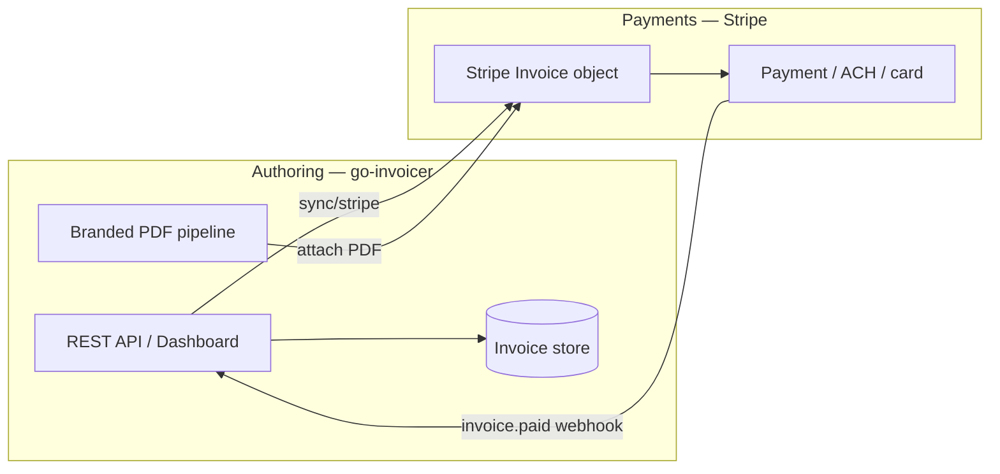

# Replace Stripe Invoicing

Use **go-invoicer** for invoice documents (layout, branding, compliance, archive) and **Stripe** only for what it does best: **payment collection**, subscriptions, and customer billing objects.

You do **not** need Stripe’s hosted invoice PDF or Stripe Invoicing UI if you adopt this pattern.

**Plan:** Starter+ (`stripe` feature). **Setup:** [Stripe integration](stripe-integration.md).

---

## What “replace” means

| Concern | Stripe Invoicing (default) | go-invoicer + Stripe |
|---------|---------------------------|----------------------|
| PDF layout & branding | Limited Stripe templates | Full HTML templates, logo, Swiss QR, e-invoice |
| Invoice authoring | Stripe Dashboard / API | Dashboard, API, schedules, inbound hook |
| Sending invoice email | Stripe | Stripe (`finalize_send`) or your ESP (future) |
| **Payment collection** | Stripe | **Still Stripe** (Cards, SEPA, Link, etc.) |
| Payment status | Stripe Dashboard | Webhook → local `status: paid` + optional your ledger |
| Archive / compliance | Export from Stripe | Compliance ZIP, XRechnung, ZUGFeRD (plan-gated) |

go-invoicer is **not** a payment processor. It does not replace Stripe **Payments**, **Billing** metered usage, or **Checkout** for charging cards.

---

## Recommended architecture



1. **Create** invoice in go-invoicer (or import from your product DB via generate API).
2. **Export** to Stripe (`POST /v1/invoices/:id/sync/stripe`) — creates a draft `in_…` linked to a Stripe Customer.
3. **Render** branded PDF; platform uploads to Stripe and links URL + file on the invoice.
4. **Finalize & send** (auto or manual) — customer pays via Stripe’s hosted invoice page or saved payment method.
5. **Track payment** — `invoice.paid` webhook sets local status to **`paid`** and refreshes line items.

---

## Configuration

### Stripe billing mode

**Settings → Integrations → Stripe**

| Mode | When to use |
|------|-------------|
| `attach_only` | You control finalize/send in Stripe Dashboard; go-invoicer only supplies the PDF. |
| `finalize_send` | Fully automated: after PDF upload, platform calls Stripe finalize + send. |

API field: `stripe_billing_mode` on org rendering profile (`attach_only` | `finalize_send`).

### Stripe Dashboard

- Use **Stripe Invoices** API objects for amounts and tax lines (synced from go-invoicer).
- Disable reliance on Stripe’s default PDF — customers receive your branded PDF via Stripe attachment / custom field.
- Configure payment methods on the Stripe account as usual.

---

## End-to-end flows

### Flow A — Create in go-invoicer, bill via Stripe

```http
POST /v1/invoices
{ "invoice": { … }, "status": "draft" }
```

```http
POST /v1/invoices/{id}/sync/stripe
```

Wait for PDF job → if `finalize_send`, Stripe emails customer; else:

```http
POST /v1/invoices/{id}/stripe/bill
```

### Flow B — Automation / ERP

```http
POST /v1/invoices/generate

{
  "invoice": { … },
  "status": "draft",
  "render_pdf": true,
  "sync_stripe": true
}
```

With `finalize_send`, billing runs automatically after PDF attach.

### Flow C — Stripe-first (legacy migration)

1. Keep creating drafts in Stripe during migration.
2. `POST /v1/integrations/stripe/import` with `in_…` **or** webhook `invoice.finalized`.
3. go-invoicer renders branded PDF and re-attaches to the same Stripe invoice.
4. Gradually move authoring to Flow A/B.

---

## Payment tracking (like Stripe)

Stripe remains the **source of truth for money movement**. go-invoicer mirrors **document + status** for operations and reporting.

### Built-in today

| Signal | Behavior |
|--------|----------|
| `invoice.finalized` webhook | Upsert invoice, status `synced`, queue PDF |
| `invoice.paid` webhook | Upsert invoice, status **`paid`**, queue PDF |
| Manual status | `PUT /v1/invoices/:id` with `"status": "paid"` |
| Generate / hook | Set `"status"` in request body (`draft`, `sent`, `paid`, …) |
| External link | `external_source: stripe`, `external_id: in_…` on record |

List and filter in the dashboard by status. Export compliance ZIP includes invoice snapshots.

### Stripe metadata (optional)

When exporting, the platform sets Stripe invoice metadata:

- `go_invoicer_pdf_url`
- `go_invoicer_render_job_id`
- `go_invoicer_pdf_file_id`

Add your own keys in the domain invoice `metadata` map before `sync/stripe` for cross-system IDs (e.g. `order_id`, `subscription_id`).

### Reporting patterns

| Need | Approach |
|------|----------|
| **Paid vs open** | Filter API/dashboard by `status` (`paid`, `synced`, `draft`) |
| **Revenue in Stripe** | Stripe Sigma / Billing reports (unchanged) |
| **Branded PDF archive** | go-invoicer compliance export or S3 PDF jobs |
| **ERP sync** | On `invoice.paid`, your worker calls Xero/QBO export or inbound to ERP |
| **Custom ledger** | Webhook handler → your DB (Phase 6 **outbound webhooks** planned for `invoice.paid` / PDF ready) |

### What is not built yet (roadmap)

- Native payment ledger (allocations, partial payments, refunds UI)
- `payment_intent.succeeded` handler (use Stripe Dashboard or custom worker)
- Buyer portal payment history (Phase 7)
- Receipts / settlement reports (Phase 7)

For those, keep using **Stripe Dashboard** or subscribe to Stripe webhooks directly alongside go-invoicer.

---

## Replace Stripe **completely** (no Stripe at all)

If you do not use Stripe for payments:

| Need | Alternative |
|------|-------------|
| Invoicing & PDF | go-invoicer only (Free tier + quota) |
| Bank transfer / QR | Swiss QR-bill template + IBAN in Settings |
| Payment confirmation | Set `status: paid` via API when bank file / ERP confirms |
| Card payments | Integrate Adyen, Mollie, etc. at app layer; go-invoicer does not process cards |
| Accounting | [Xero](xero-integration.md) / [QuickBooks](quickbooks-integration.md) (Pro+) for AR, or compliance export |

You do **not** need the `stripe` feature slug. Use [Paid features — automation](paid-features.md#automation-all-plans) and [Accounting integrations](accounting-integrations.md).

---

## Comparison checklist

Use go-invoicer as the invoice system of record when you need:

- [ ] Custom HTML/PDF templates and Studio preview
- [ ] Swiss QR-bill or EU e-invoice (XRechnung, ZUGFeRD) on Business+
- [ ] Compliance ZIP and audit trail (Pro+)
- [ ] Cron schedules and inbound hooks without Stripe
- [ ] Same invoice model in Go (OSS) and hosted API

Keep Stripe when you need:

- [ ] Card/SEPA collection and Stripe Billing subscriptions
- [ ] Stripe-hosted payment page for `in_…` invoices
- [ ] Stripe Tax / Revenue Recognition (use Stripe’s products alongside sync)

---

## Related

- [Stripe integration](stripe-integration.md) — credentials, webhooks, API reference
- [Paid features](paid-features.md) — plans and entitlements
- [Hosted platform](hosted-platform.md) — feature matrix
